# Portfolio Management Backend API

A RESTful Backend API built using Node.js, Express.js, MongoDB, and JWT Authentication for managing user portfolios, projects, skills, and dashboard statistics.

## Features

### Authentication
- User Registration
- User Login
- JWT Authentication
- Protected Routes

### Project Management
- Add New Project
- Get All User Projects
- Get Project By ID
- Update Project
- Delete Project
- Search Projects
- Category Based Projects

### Portfolio Management
- Create Portfolio
- Get Portfolio Details
- Update Portfolio

### Skill Management
- Add Skills
- Get All Skills
- Update Skills
- Delete Skills

### Dashboard Statistics
- Total Projects Count
- Total Skills Count
- Category-wise Project Statistics

---

## Tech Stack

- Node.js
- Express.js
- MongoDB Atlas
- Mongoose
- JWT Authentication
- bcryptjs
- Thunder Client

---

## Project Structure

```bash
portfolio-management-backend
│
├── Controllers
│   ├── user.js
│   ├── project.js
│   ├── portfolio.js
│   ├── skill.js
│   └── dashboard.js
│
├── Middleware
│   └── Auth.js
│
├── Models
│   ├── User.js
│   ├── Project.js
│   ├── Portfolio.js
│   └── Skill.js
│
├── Routes
│   ├── user.js
│   ├── project.js
│   ├── portfolio.js
│   ├── skill.js
│   └── dashboard.js
│
├── .env
├── server.js
└── package.json
```

---

## Installation

### Clone Repository

```bash
git clone <your-github-repository-link>
```

### Navigate to Project Directory

```bash
cd portfolio-management-backend
```

### Install Dependencies

```bash
npm install
```

### Create Environment Variables

Create a `.env` file in the root directory.

```env
PORT=5000

MONGO_URI=your_mongodb_connection_string

JWT=your_secret_key
```

### Start Development Server

```bash
npm run dev
```

Server will run on:

```bash
http://localhost:5000
```

---

# Authentication APIs

## Register User

### Endpoint

```http
POST /api/user/register
```

### Request Body

```json
{
  "name": "Jafar Ali",
  "email": "jafar@gmail.com",
  "password": "123456"
}
```

### Response

```json
{
  "message": "User registered successfully",
  "success": true
}
```
### Screenshot

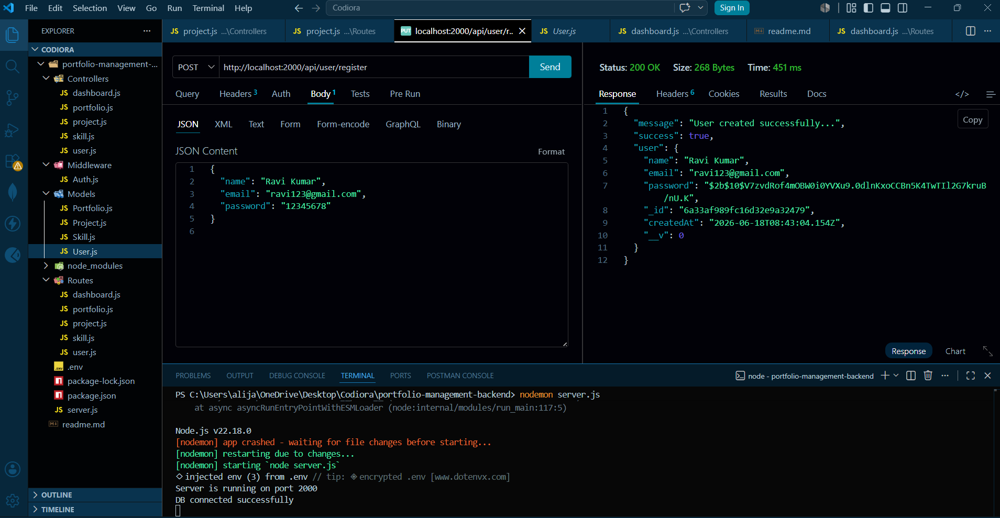

---

## Login User

### Endpoint

```http
POST /api/user/login
```

### Request Body

```json
{
  "email": "jafar@gmail.com",
  "password": "123456"
}
```

### Screenshot

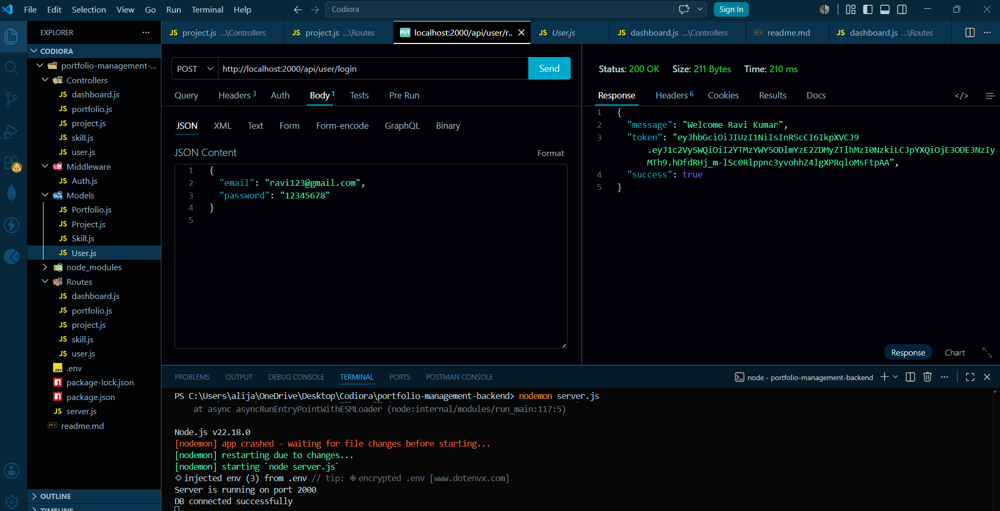


---

# Project APIs

## Add Project

### Endpoint

```http
POST /api/project/new
```

### Screenshot

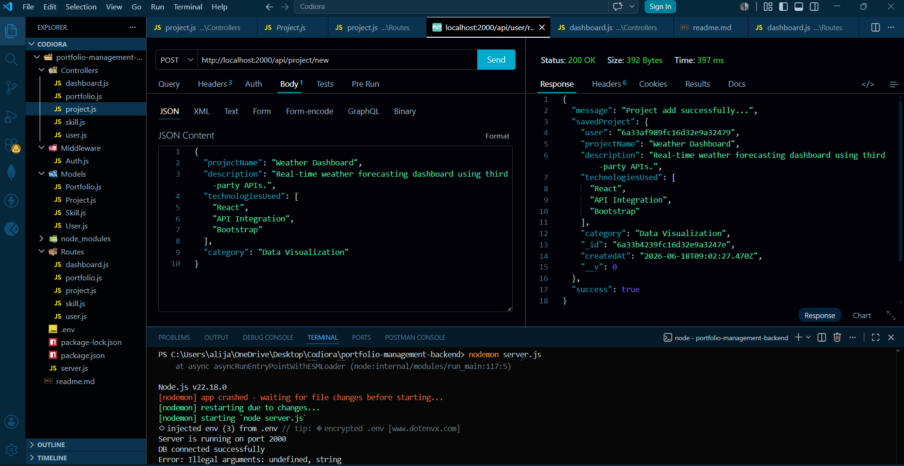


---

## Get All Projects

### Endpoint

```http
GET /api/project
```

### Screenshot

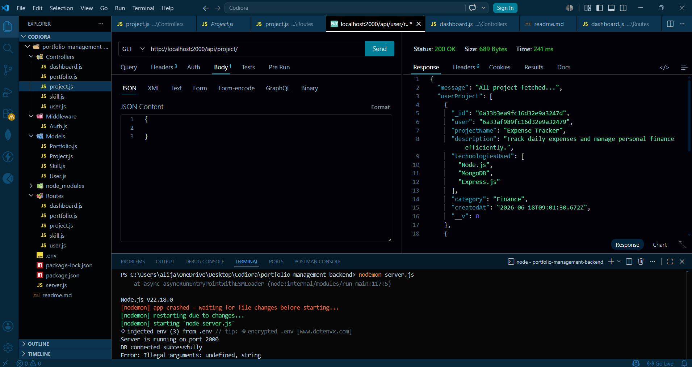

---

## Update Project

### Endpoint

```http
PUT /api/project/:id
```

### Screenshot

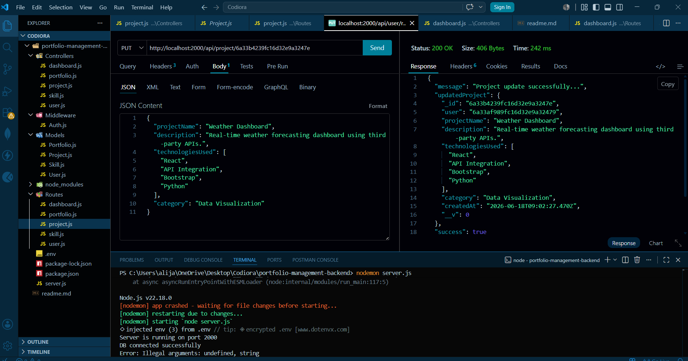


---

## Search Project

### Endpoint

```http
GET /api/project/search
```

### Examples

```http
GET /api/project/search?name=atlas
```

```http
GET /api/project/search?category=Web Development
```

```http
GET /api/project/search?technology=React
```

### Screenshot

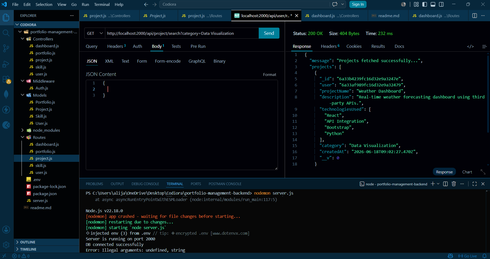


---

# Portfolio APIs

## Create Portfolio

### Endpoint

```http
POST /api/portfolio/new
```

### Screenshot

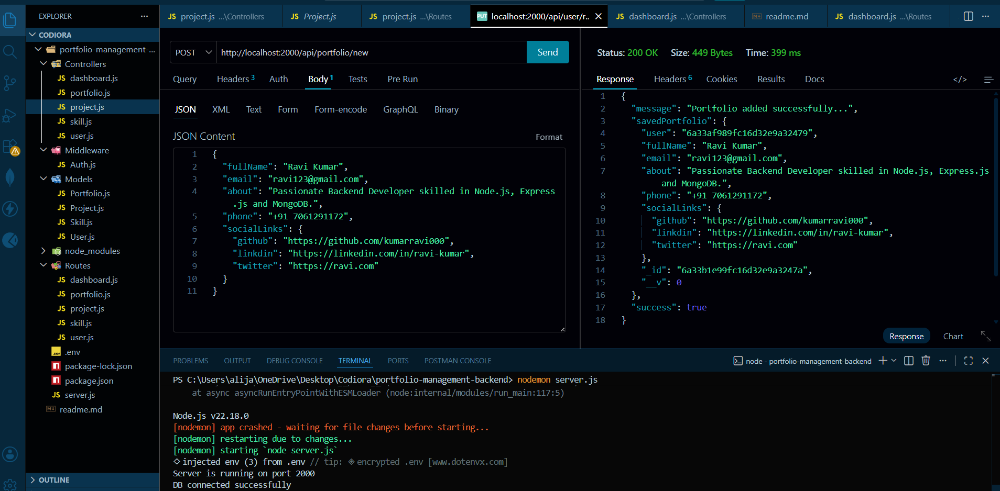


---

## Get Portfolio

### Endpoint

```http
GET /api/portfolio
```

### Screenshot

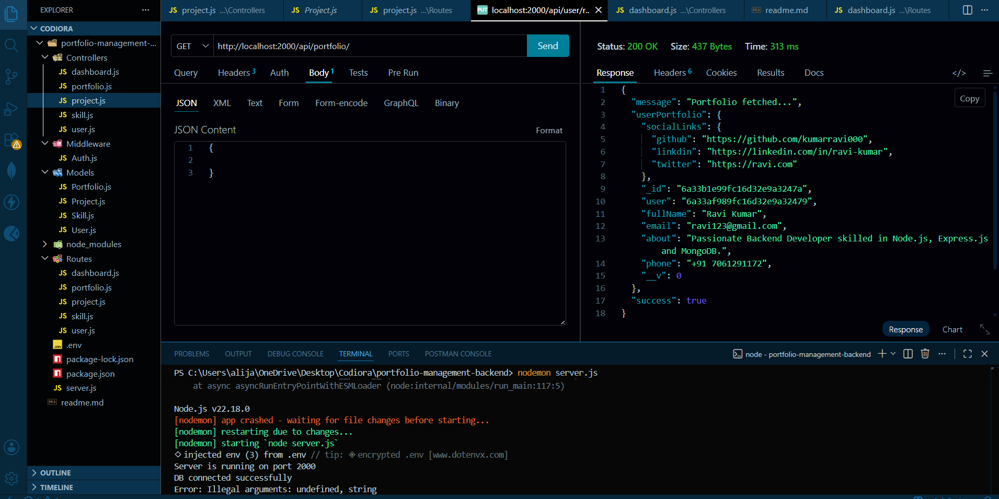


---

## Update Portfolio

### Endpoint

```http
PUT /api/portfolio
```

### Screenshot

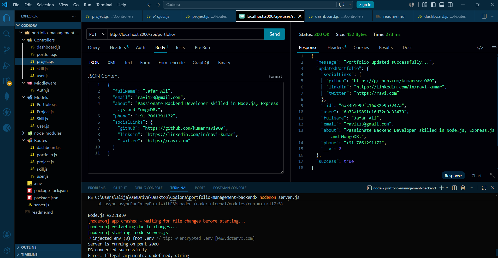


---

# Skill APIs

## Add Skill

### Endpoint

```http
POST /api/skill/new
```

### Screenshot

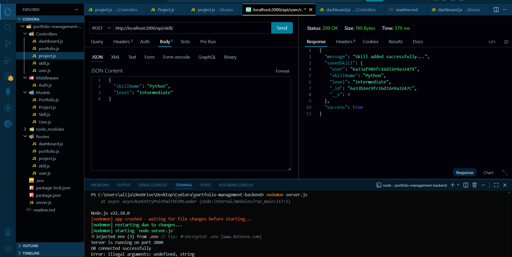


---

## Get Skills

### Endpoint

```http
GET /api/skill
```

### Screenshot

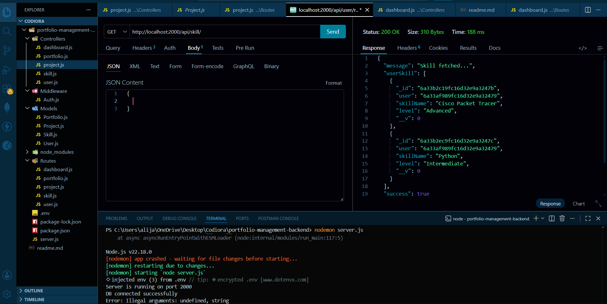


---

## Update Skill

### Endpoint

```http
PUT /api/skill/:id
```

### Screenshot

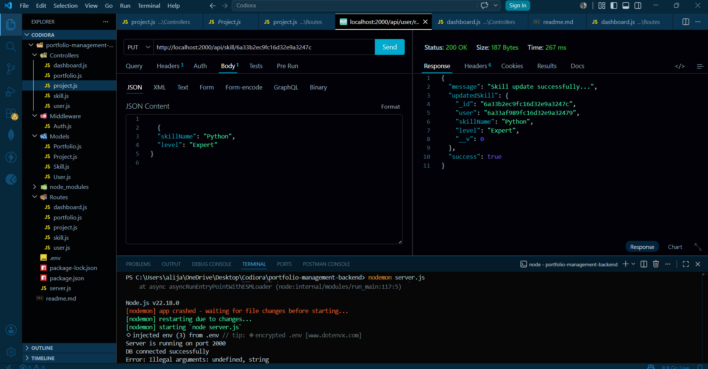

---

# Dashboard API

## Get Dashboard Statistics

### Endpoint

```http
GET /api/dashboard/stats
```

### Sample Response

```json
{
  "totalProjects": 5,
  "totalSkills": 8,
  "categoryCounts": {
    "Web Development": 3,
    "Mobile Development": 1,
    "Data Analysis": 1
  }
}
```

### Screenshot

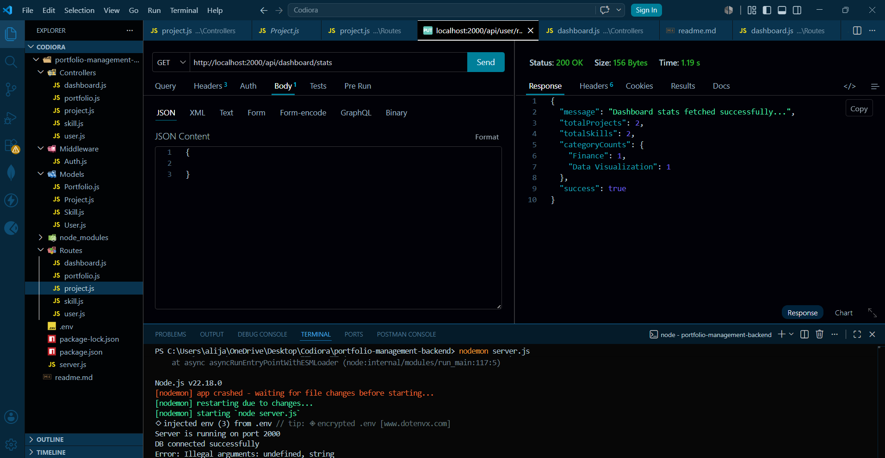


---

# API Testing

All APIs were tested using Thunder Client.

### Authentication Header

```http
Auth: JWT_TOKEN
```

Depending on middleware implementation.

---

# Future Improvements

- Swagger Documentation
- Pagination
- Project Image Upload
- Portfolio Resume Upload
- User Profile Image Upload
- Advanced Filtering
- Project Sorting

---

# Author

### Jafar Ali

Backend Developer Intern

GitHub:
https://github.com/alijafar000

---

# Internship Task

This project was developed as part of the Backend Developer Internship Program at Codiora Software House.